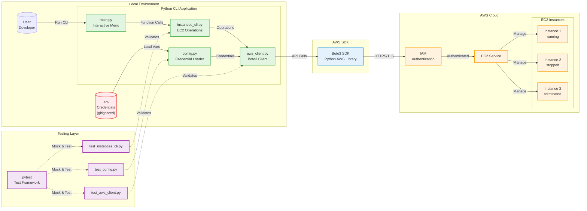

# AWS EC2 Instance Manager - Architecture Diagram

## System Architecture



## CLI Operations

The application supports the following EC2 operations:

| Operation | Function | Description |
|-----------|----------|-------------|
| List | `list_instances()` | Display all EC2 instances with details |
| Filter | `filter_instances_by_state()` | Filter instances by state (running, stopped, etc.) |
| Create | `create_instance()` | Launch new EC2 instances |
| Stop | `stop_instances()` | Stop running instances |
| Start | `start_instances()` | Start stopped instances |
| Reboot | `reboot_instances()` | Reboot running instances |
| Terminate | `terminate_instances()` | Permanently delete instances |

## Data Flow

1. **User Input**: Developer runs the CLI and selects an operation from the interactive menu
2. **Credential Loading**: `config.py` loads AWS credentials from `.env` file using python-dotenv
3. **Client Creation**: `aws_client.py` creates a configured boto3 EC2 client with credentials
4. **Operation Execution**: `instances_cli.py` executes the requested EC2 operation
5. **API Communication**: boto3 SDK makes HTTPS requests to AWS API endpoints
6. **Authentication**: IAM validates credentials and permissions
7. **EC2 Service**: AWS EC2 service processes the request and manages instances
8. **Response**: Results flow back through the chain to the user

## Security Architecture

- **Credential Storage**: AWS credentials stored in `.env` file (excluded from git via `.gitignore`)
- **python-dotenv**: Loads environment variables from `.env` file securely
- **No Hardcoded Secrets**: All sensitive data managed through environment variables
- **Session Token Support**: Optional AWS_SESSION_TOKEN for temporary credentials
- **Least Privilege**: IAM policies should grant minimum required EC2 permissions

## Testing Architecture

- **Unit Tests**: 37 comprehensive tests with 100% coverage on business logic
- **Mocking**: All AWS API calls mocked using pytest-mock to avoid actual API calls
- **Isolation**: Tests run independently without requiring AWS credentials
- **Coverage**: pytest-cov reports coverage metrics, excluding interactive entry point (main.py)

## Technology Stack

| Component | Technology | Version | Purpose |
|-----------|-----------|---------|---------|
| Language | Python | 3.12+ | Core application language |
| AWS SDK | boto3 | 1.35.93 | AWS service integration |
| Query | jmespath | 1.0.1 | JSON query language for filtering |
| Config | python-dotenv | 1.0.1 | Environment variable management |
| Testing | pytest | 9.0.1 | Test framework |
| Coverage | pytest-cov | 7.0.0 | Code coverage reporting |
| Mocking | pytest-mock | 3.15.1 | AWS API mocking |

## Project Structure

```
reto-2-python-generation/
├── src/
│   ├── config.py              # Credentials & region management
│   ├── aws_client.py          # EC2 client creation
│   ├── instances_cli.py       # All EC2 operations
│   └── main.py                # Interactive menu entry point
├── tests/
│   ├── test_config.py         # 8 tests for configuration
│   ├── test_aws_client.py     # 5 tests for client creation
│   └── test_instances_cli.py  # 24 tests for CLI operations
├── .env                       # AWS credentials (gitignored)
├── .env.example               # Template for credentials
├── requirements.txt           # Python dependencies
└── setup.cfg                  # pytest configuration
```
